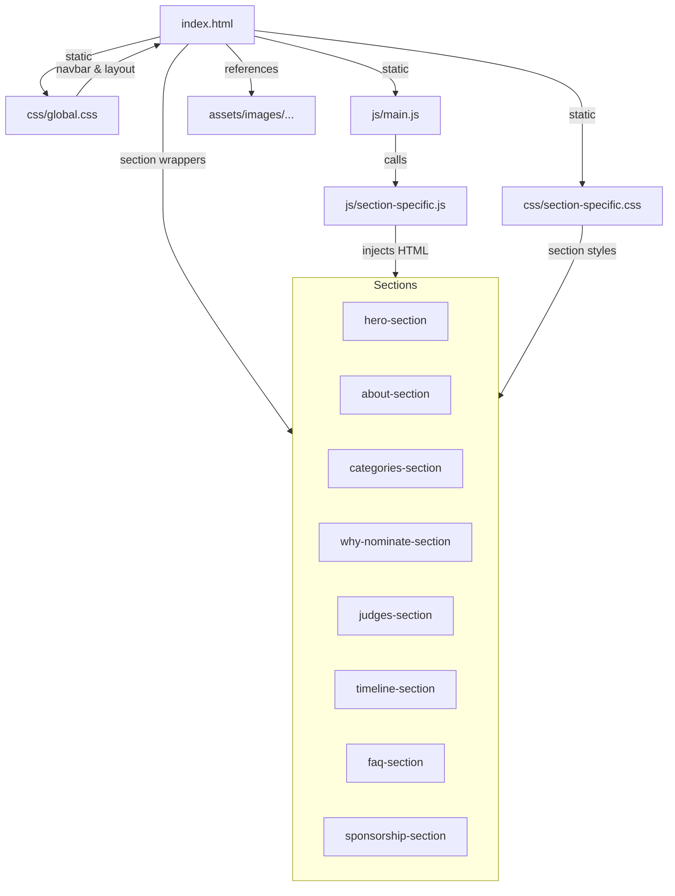

Here is a detailed architectural summary of the Cyber UXcellence Awards project, with findings based on README.md, index.html, and main.js:

---

## 1. **High-Level Architecture & Modularity**

**Philosophy:**  
- _Strict modularity, separation of concerns, and scalability for static site deployment._

### **Directory Structure**
- `/index.html` — main entry point; contains all navigation, section wrappers, and critical shared markup.
- `/sections/` — each section (hero, about, categories, etc.) has its own HTML fragment (not auto-included, but present for development clarity).
- `/css/` — global.css (site-wide structure, navbar, variables), plus one css file per section.
- `/js/` — main.js (site entry point), one JS module per section, plus global utility files (analytics, hubspot-form, etc.).
- `/assets/` — all images, brand assets, icons, and supporting graphics.
- `/updatesNameOrder/` — documentation and update tracking (markdowns, images).

---

## 2. **index.html Composition**

- **CSS**: All stylesheets (global and per-section) are loaded statically in the `<head>`, ensuring every section's styles are available everywhere.
- **JS**: Only one script is loaded: `js/main.js` (as a module).
- **Structure**:
  - Navigation is coded directly within index.html.
  - `<main>` contains a series of `<section>` elements for each content area:
    - The "hero" and "about" sections are fully marked up inline.
    - The rest (`categories`, `why-nominate`, `judges`, `timeline`, `faq`, `sponsorship`) are empty wrappers, to be populated by JS.
  - The footer and cookie consent are also static.

---

## 3. **Dynamic Section Population**

- **main.js** orchestrates the page:
  - Imports an initialization function for each section (e.g., `initCategories`).
  - On `DOMContentLoaded`, runs `initSections()`, which sequentially calls each section's initializer.
  - Each section’s JS module is responsible for injecting its own HTML markup into its corresponding `<section>` wrapper (e.g., `document.getElementById('categories')`).
  - No external AJAX/fetch: All content comes from JS modules, not from `/sections/*.html` at runtime.

---

## 4. **Other Notable Features**

- **Global JS Features**:
  - Mobile menu toggle
  - Smooth scroll for nav links
  - Navbar scroll effect
  - Modals (nomination, with HubSpot form)
  - Cookie consent banner
  - Event delegation for dynamic nomination buttons
  - Analytics stub
- **Branding**:
  - Strict font, color, and pattern adherence (Inter, Roboto Mono, SVG/PNG icons).
  - Accessibility (WCAG 2.1 AA) and mobile-first responsiveness are key.

---

## 5. **Mermaid Diagram: Architecture Overview**



---

## 6. **Summary Table of Section Integration**

| Section         | HTML in index.html | CSS Loaded | JS Module Injects Content? | Notes             |
|-----------------|-------------------|------------|----------------------------|-------------------|
| Hero            | Yes               | Yes        | Yes                        | Static markup     |
| About           | Yes               | Yes        | Yes                        | Static markup     |
| Categories      | Empty             | Yes        | Yes                        | Injected by JS    |
| Why Nominate    | Empty             | Yes        | Yes                        | Injected by JS    |
| Judges          | Empty             | Yes        | Yes                        | Injected by JS    |
| Timeline        | Empty             | Yes        | Yes                        | Injected by JS    |
| FAQ             | Empty             | Yes        | Yes                        | Injected by JS    |
| Sponsorship     | Empty             | Yes        | Yes                        | Injected by JS    |

---

## 7. **Next Steps / Questions for You**

1. **Is this architectural understanding accurate and sufficient for planning updates?**
2. **Would you like a similar summary for a specific section or deeper dive on a particular aspect (e.g., JS module pattern, CSS variable strategy, or accessibility)?**
3. **Should I proceed to create a markdown summary file of this architecture for future reference?**

```