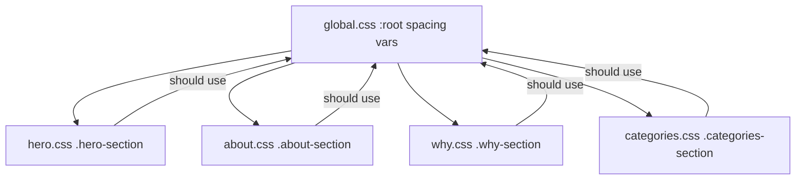

# Review: Navbar Center Alignment of Logo, Nav Items, and Button

## 62. Requirement
> Nav items should be center aligned with the logo and button.

---

## Audit

### 1. HTML Structure (`index.html`)
- Navbar structure is:
  ```
  <nav class="main-nav">
    <div class="container">
      <div class="logo">...</div>
      <div class="nav-links">...</div>
      <div class="mobile-menu-toggle">...</div>
    </div>
  </nav>
  ```
- The `.container` is styled in CSS to use `display: flex; justify-content: space-between; align-items: center;`

### 2. CSS Structure (`css/global.css`, `css/navBarGlobalCss.md`)
- `.main-nav .container { display: flex; justify-content: space-between; }`
- This aligns three columns: left (logo), middle (nav links), right (mobile toggle or blank space on desktop).
- **This does NOT mathematically center the nav links as a group between the left and right edges.**

### 3. Visual Review
- On desktop, the nav links may *appear* visually centered, but are actually offset if the logo block is not the same width as the button block.

### 4. Solution
- **If true center alignment is required:**  
  Use either:
  - CSS grid for three columns, and center the middle column.
  - Or, use flex with `flex: 1` for logo and button containers to force the nav links to center.
- The current setup does NOT guarantee visual center alignment.

---

## Conclusion

- **The nav items are NOT mathematically center-aligned with the logo and button on desktop.**
- **Path to current markup:**  
  - Main nav: `/Users/willf/cyberuxcellence-clean_localTESTCopy/newVersionCyberUXcellence/index.html`
  - Nav styles: `/Users/willf/cyberuxcellence-clean_localTESTCopy/newVersionCyberUXcellence/css/global.css`, `/Users/willf/cyberuxcellence-clean_localTESTCopy/newVersionCyberUXcellence/css/navBarGlobalCss.md`

## If Solution Needed

- **Path to update:**  
  - `index.html` (nav markup)
  - `css/global.css` (nav layout CSS)
- **What to do:**  
  - Refactor `.main-nav .container` to use either CSS grid or flex with `.logo`, `.nav-links`, and `.mobile-menu-toggle` all set with `flex: 1 1 0;` and `.nav-links { justify-content: center; }` so nav links are always centered between logo and button.

---

## Next Steps

- Team to decide if strict center alignment is required.
- If yes, implement layout changes as above and test visually.


63. Remove Wave - no longer a wave is used

64. Orange and white color combination doens't pass compliance. The buttons either need a different color combo or update the gradient to skew more red than orange.

65. Hero section, I would prefer left aligned content (mimicking the logo) and removing the background shape.  Other visual suggestions:
Remove underline from text, looks too much like a link style
Headline should all be the same size, we could have some text bold and some not but the H1 should all be the same size.
Update the background gradient to match darker colors from the Judges section - done 

66. Inconsistent spacing throughout the various page sections. Would like to see more spacing above the header here. (make sure there is enough space for the logo to be centered in the header)
- I would like to see the spacing between the sections be more consistent.  For example, the spacing between the header and the hero section is different than the spacing between the hero and the About section.  I would like to see this spacing be more consistent throughout.)

## Analysis: Section Spacing Consistency in Your Project

### 1. **Current Spacing Mapping (by Section) and File Paths**

| Section      | Selector/Class           | Path                         | Top Padding           | Bottom Padding        | Notes           |
|--------------|-------------------------|------------------------------|-----------------------|----------------------|-----------------|
| **Hero**     | `.hero-section`         | css/hero.css (line 9)        | 160px (hardcoded)     | 120px (hardcoded)    | **Not using variables; much larger** |
| **About**    | `.about-section`        | css/about.css (line 9)       | var(--spacing-xxl)    | var(--spacing-xl)    | 80px / 48px     |
| **Why**      | `.why-section`          | css/why.css (line 8)         | var(--spacing-xxl)    | var(--spacing-xxl)   | 80px / 80px     |
| **Categories**| `.categories-section`  | css/categories.css (line 9)  | 70px (hardcoded)      | 100px (hardcoded)    | Slightly less than variables, custom negative margin |
| **Default Section** | `section`        | css/global.css (line 167)    | var(--spacing-xxl)    | 0 (except last)      | 80px top default |

- **Header/Logo**: The `.main-nav .container` layout (css/global.css and/or css/navBarGlobalCss.md) controls horizontal position, but vertical space above the header/logo is handled by `body { padding-top: var(--nav-height); }` (css/global.css, line 82) — this is set to 88px via `--nav-height`.

---

### 2. **Inconsistencies Identified**

- **Hero** uses much larger, hardcoded top/bottom padding (160px/120px), not variables.
- **Categories** also uses hardcoded values (70px/100px) and a negative margin to pull the section up.
- **About** and **Why** use the variable-based system (80px/48px or 80px/80px).
- The default for all `section` tags is top padding 80px (`--spacing-xxl`).

---

### 3. **Professional Consistent Spacing System (Recommendation)**

#### a. **Use Variables Consistently**
- Replace all hardcoded paddings/margins for major sections with the spacing variables defined in `:root` in css/global.css.
- This ensures all sections can be tuned by editing the variables only.

#### b. **Recommended Section Spacing Pattern**
- **Top and bottom padding for all major sections:**  
  `padding: var(--spacing-xxl) 0;`  
  (equals 80px top and bottom as per your current variables).

- For any section requiring visual emphasis (e.g., Hero), consider:
  - At most: `padding: calc(var(--spacing-xxl) * 1.5) 0;` (for 120px)
  - But avoid exceeding 2x the default unless for a landing "splash" hero.

#### c. **Header/Logo Vertical Spacing**
- `body { padding-top: var(--nav-height); }` (currently 88px) is a good approach.
- Ensure the logo's container inside the nav has `align-items: center;` and no excess margin/padding above.
- If you want additional space above the logo, increase `--nav-height`.

---

### 4. **How to Update (Paths & Example Changes)**

**Paths to change:**
- Hero: css/hero.css (line 9)
- Categories: css/categories.css (line 9, 11)
- About/Why: css/about.css, css/why.css (already good, just confirm)
- Global fallback: css/global.css (section rules)

**Example Update for the Hero Section:**
```css
/* OLD */
.hero-section {
  padding: 160px 0 120px;
}
/* NEW */
.hero-section {
  padding: var(--spacing-xxl) 0;
}
```
Or, for slight visual emphasis:
```css
.hero-section {
  padding: calc(var(--spacing-xxl) * 1.5) 0;
}
```

**Example Update for Categories Section:**
```css
/* OLD */
.categories-section {
  padding: 70px 0 100px;
  margin-top: -46px;
}
/* NEW */
.categories-section {
  padding: var(--spacing-xxl) 0;
  margin-top: 0;  /* Remove negative margin unless absolutely required */
}
```

**If you want to fine-tune spacing between specific sections:**
- Add a utility class (e.g., `.section--emphasis`) to bump up padding for just one section, but do not use hardcoded pixel values.

---

### 5. **Mermaid Diagram: Spacing Architecture**




---

### 6. **Summary Table: Section Spacing Settings**

| Section    | File/Selector                  | Top Padding      | Bottom Padding   | Consistency? |
|------------|--------------------------------|------------------|------------------|--------------|
| Hero       | css/hero.css .hero-section     | 160px (hardcoded)| 120px (hardcoded)| ❌           |
| About      | css/about.css .about-section   | 80px             | 48px             | ✔️           |
| Why        | css/why.css .why-section       | 80px             | 80px             | ✔️           |
| Categories | css/categories.css .categories-section | 70px (hardcoded) | 100px (hardcoded)  ❌   |

---

## Next Steps

1. **Refactor all major page sections to use `padding: var(--spacing-xxl) 0;` for both top and bottom spacing.**
2. **Remove negative margins and hardcoded pixel paddings.**
3. **Leave only global.css variables for spacing, so tuning is easy and consistent.**
4. **For the header/logo:**  
   - Keep using `body { padding-top: var(--nav-height); }` for vertical offset.
   - Center logo with flexbox/grid as needed (see ReviewAppMarkupNotes.md for advanced centering if required).

---

### Are you pleased with this plan for consistent spacing, or would you like to adjust the section spacing scale or emphasis for certain sections?
If you approve, I can provide a markdown documentation file with these spacing guidelines and paths for implementation. Would you like that?

app.markup.io 
67-68 are no longer an issue.

69. orange changed to white font.

70. done - using canva - either do a circle or a rounded rectangle shape. The oval looks odd.

71. no longer using - "I would remove the card style background and have this quote sit on a full width background. Maybe knocked out of the almost black color or purple with one of the patterns. A more stylized curly quote mark would like nicer than the straight quote marks here."

72. (using left align) - If we update the hero to be left-aligned, we may want to consider updating the other headers on the page to be the same.
