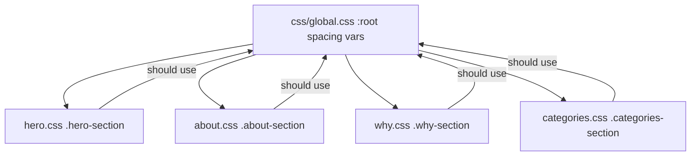

# Section Spacing Architecture: Documentation and How-To Standardize

## 1. Current Section Spacing Settings

| Section      | Selector/Class           | Path                         | Top Padding           | Bottom Padding        | Notes           |
|--------------|-------------------------|------------------------------|-----------------------|----------------------|-----------------|
| **Hero**     | `.hero-section`         | css/hero.css (line 9)        | 160px (hardcoded)     | 120px (hardcoded)    | Not using variables; much larger than others |
| **About**    | `.about-section`        | css/about.css (line 9)       | var(--spacing-xxl)    | var(--spacing-xl)    | 80px / 48px     |
| **Why**      | `.why-section`          | css/why.css (line 8)         | var(--spacing-xxl)    | var(--spacing-xxl)   | 80px / 80px     |
| **Categories**| `.categories-section`  | css/categories.css (line 9)  | 70px (hardcoded)      | 100px (hardcoded)    | Custom, negative margin applied |
| **Default Section** | `section`        | css/global.css (line 167)    | var(--spacing-xxl)    | 0 (except last)      | 80px top default |

**Header/Logo Spacing:**  
- Controlled by `body { padding-top: var(--nav-height); }` in css/global.css (line 82).  
- `--nav-height` is set to 88px, ensuring enough space for the logo to be centered in the header.

---

## 2. How to Change: Standardize Section Spacing

### Recommended Pattern for Consistency

- **Top and bottom padding for all major sections:**  
  `padding: var(--spacing-xxl) 0;`  
  (equals 80px top and bottom by default, set in css/global.css)

- **For extra emphasis (e.g., Hero):**  
  `padding: calc(var(--spacing-xxl) * 1.5) 0;`  
  (equals 120px top and bottom if --spacing-xxl is 80px)

### Example: Update Each Section

#### Hero Section (css/hero.css)
```css
/* OLD */
.hero-section {
  padding: 160px 0 120px;
}
/* NEW (standardized) */
.hero-section {
  padding: var(--spacing-xxl) 0;
}
/* Or, for extra emphasis */
.hero-section {
  padding: calc(var(--spacing-xxl) * 1.5) 0;
}
```

#### About Section (css/about.css)
```css
/* OLD */
.about-section {
  padding: var(--spacing-xxl) 0 var(--spacing-xl);
}
/* NEW (full standardization) */
.about-section {
  padding: var(--spacing-xxl) 0;
}
```

#### Why Section (css/why.css)
```css
/* Already uses standardized spacing */
.why-section {
  padding: var(--spacing-xxl) 0;
}
```

#### Categories Section (css/categories.css)
```css
/* OLD */
.categories-section {
  padding: 70px 0 100px;
  margin-top: -46px;
}
/* NEW (standardized) */
.categories-section {
  padding: var(--spacing-xxl) 0;
  margin-top: 0; /* Remove unless negative margin is visually needed */
}
```

---

## 3. How to Tune Spacing for All Sections

- **Edit `:root` in css/global.css** to change variables for all sections:
  ```css
  :root {
    --spacing-xxl: 80px;
    --spacing-xl: 48px;
    /* ... */
  }
  ```
- **Adjust the value of `--spacing-xxl`** to globally increase or decrease all section spacing.

---

## 4. Header/Logo Spacing

- **Vertical space above header/logo:**  
  Controlled by `body { padding-top: var(--nav-height); }` (css/global.css, line 82).  
  Adjust `--nav-height` in `:root` (css/global.css, line 56) to increase/decrease space.

---

## 5. Diagram: Spacing Architecture



---

## 6. Summary Table

| Section    | File/Selector                  | Top Padding      | Bottom Padding   | Uses Variable? |
|------------|-------------------------------|------------------|------------------|---------------|
| Hero       | css/hero.css .hero-section     | 160px            | 120px            | ❌            |
| About      | css/about.css .about-section   | 80px             | 48px             | ✔️            |
| Why        | css/why.css .why-section       | 80px             | 80px             | ✔️            |
| Categories | css/categories.css .categories-section | 70px           | 100px            | ❌            |

---

## 7. Implementation Paths

- **To change section spacing:**  
  - Hero: `css/hero.css` (line 9)
  - About: `css/about.css` (line 9)
  - Why: `css/why.css` (line 8)
  - Categories: `css/categories.css` (line 9, 11)

- **Spacing variables:**  
  - `css/global.css` (lines 27–32 for :root spacing variables)

---

## 8. Final Notes

- You can keep current unique spacings, but for a cohesive, professional look, standardizing on spacing variables is recommended and simple to implement.
- All the above changes are reversible and tunable via the variables in `css/global.css`.